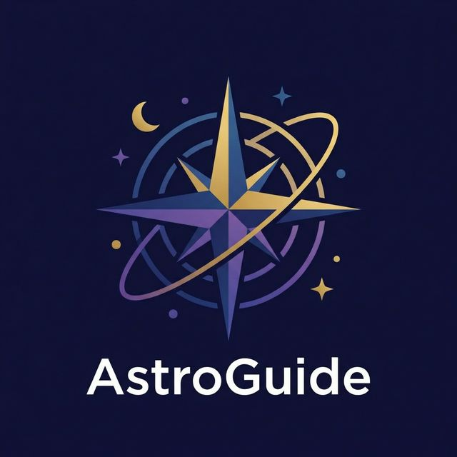

<div align="center">
  
  <h1>🚀 AstroGuide</h1>
  <p><strong>Interactive 3D Space Exploration Application</strong></p>
  
  [](https://reactjs.org/)
  [](https://vitejs.dev/)
  [](https://threejs.org/)
  [](https://www.typescriptlang.org/)
  [](https://tailwindcss.com/)
  [](https://www.docker.com/)

  <br />
</div>

AstroGuide is a high-performance, immersive web application designed to explore the cosmos. Built with React and Three.js, it offers a cinematic 3D view of planetary orbits, interactive 2D star maps, and accurate celestial size comparisons.

## ✨ Features

- **🌐 Immersive 3D Scene**: Explore the solar system, stars, and black holes with realistic textures, lighting, and cinematic orbital camera controls.
- **🗺️ Interactive 2D Map (Radar)**: A fluid, infinitely zoomable 2D radar map with vector scaling. Pan, zoom, and select constellations up to 20x magnification.
- **📏 Size Comparison Mode**: Visually compare the exact scale of planets, stars, and galaxies from smallest to largest side-by-side. 
- **📱 Fully Responsive**: Custom-built mobile interface with off-canvas hamburger menus, bottom sheets, and touch-optimized controls without sacrificing desktop layouts.
- **⚡ High Performance**: Dynamically halts the WebGL render loop when the 3D scene is inactive, ensuring a perfectly smooth UI even on low-end devices.

---

## 🛠️ Tech Stack

| Category         | Technologies Used                                                                 |
| ---------------- | --------------------------------------------------------------------------------- |
| **Frontend Core**| React 18, TypeScript, Vite                                                        |
| **3D Rendering** | Three.js, React Three Fiber (@react-three/fiber), Drei (@react-three/drei)        |
| **2D / Styling** | Tailwind CSS, Lucide React (Icons), Motion (Animations)                           |
| **State**        | Zustand (Global State Management)                                                 |
| **Deployment**   | Docker (Multi-stage build), Nginx                                                 |

---

## 🚀 Getting Started

### Prerequisites

Ensure you have [Node.js](https://nodejs.org/) (v18+) and [npm](https://www.npmjs.com/) installed on your machine.
If deploying via containers, ensure [Docker](https://docs.docker.com/get-docker/) and [Docker Compose](https://docs.docker.com/compose/install/) are available.

### Local Development Setup

1. **Clone the repository:**
   ```bash
   git clone https://github.com/lucas-lepajollec/AstroGuide.git
   cd AstroGuide
   ```

2. **Install dependencies:**
   ```bash
   npm install
   ```

3. **Start the development server:**
   ```bash
   npm run dev
   ```
   *The application will be running at `http://localhost:2499`.*

---

## 🐳 Docker Deployment

A pre-built image is published on **GitHub Container Registry** — no need to clone the repo or build anything.

**1. Create a `docker-compose.yml` file:**

```yaml
services:
  astroguide:
    image: ghcr.io/lucas-lepajollec/astroguide:latest
    container_name: astroguide-app
    ports:
      - "2502:80"
    restart: unless-stopped
```

**2. Start the container:**

```bash
docker compose up -d
```

The app will be available at **http://localhost:2502**.

---

## 📂 Project Structure

```
AstroGuide/
├── public/                 # Static assets (3D models, textures, icons)
├── src/
│   ├── components/         # UI & 3D components
│   │   ├── 3d/             # Three.js & Fiber models/scenes
│   │   ├── ui/             # Reusable UI parts (Tailwind + Lucide)
│   │   └── ...
│   ├── data/               # Celestial bodies and constellation data
│   ├── store/              # Zustand global state store
│   ├── App.tsx             # Root application component
│   ├── index.css           # Global Tailwind 4 styles
│   └── main.tsx            # React DOM entry point
├── .github/workflows/      # GitHub Actions CI/CD pipelines
├── Dockerfile              # Multi-stage production build
├── docker-compose.yml      # Docker Compose deployment setup
└── package.json            # Dependencies and scripts
```

---

## 📜 Available Scripts

| Command | Description |
|---------|-------------|
| `npm run dev` | Start development server on port 2499 |
| `npm run build` | Build the project for production with Vite |
| `npm run preview` | Preview the generated production build locally |
| `npm run lint` | Type-check project source code with TypeScript |
| `npm run clean` | Remove `dist/` folder |

---

## 🤝 Contributing

Contributions are welcome! Feel free to open an issue or submit a pull request.

1. Fork the repository
2. Create your feature branch (`git checkout -b feature/amazing-feature`)
3. Commit your changes (`git commit -m 'feat: add amazing feature'`)
4. Push to the branch (`git push origin feature/amazing-feature`)
5. Open a Pull Request

---

## 📝 License

This project is open-source and available under the [MIT License](LICENSE).

---

<div align="center">

Made with ❤️ using React, Three.js & Tailwind CSS

</div>
