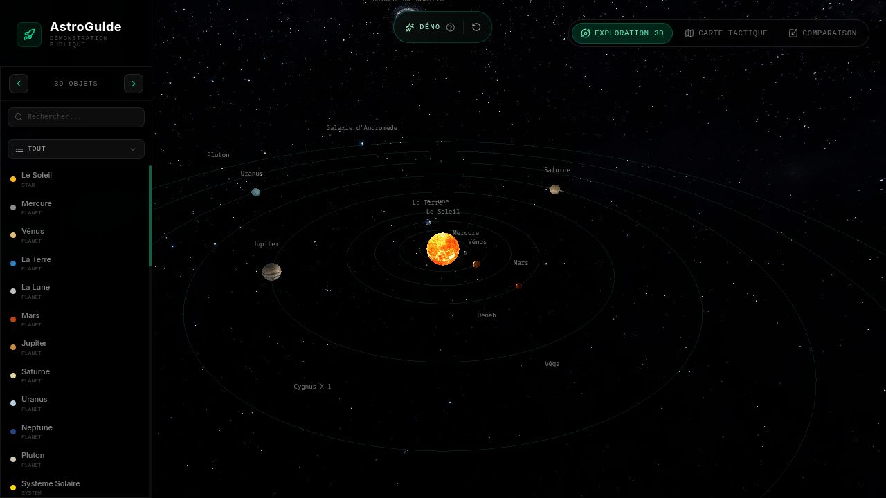
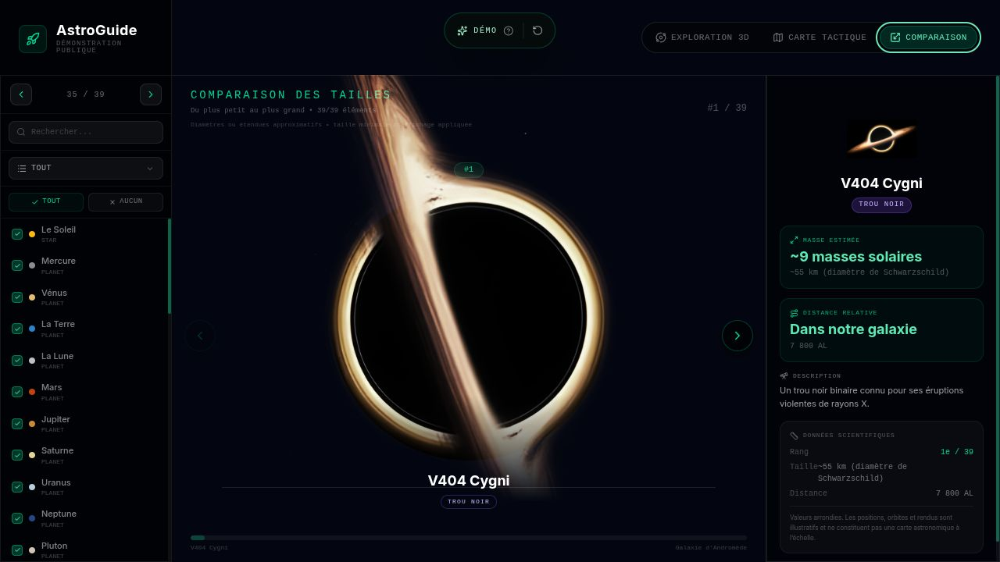

<div align="center">
  
  <h1>AstroGuide</h1>
  <p><strong>Explore astronomical objects and scale through interactive 3D, 2D, and comparison views.</strong></p>

  <p>
    <a href="https://astroguide.lucas-homelab.fr"><strong>Website</strong></a> ·
    <a href="https://demo.astroguide.lucas-homelab.fr"><strong>Live demo</strong></a> ·
    <a href="https://docs.astroguide.lucas-homelab.fr"><strong>Documentation</strong></a>
  </p>

  <p>
    <a href="LICENSE"></a>
    
    
  </p>

  
</div>

## Overview

AstroGuide turns abstract astronomical objects and orders of magnitude into something people can explore. Its catalog of 39 celestial objects is available through a navigable 3D scene, an interactive 2D map, and a visual size comparison.

The application is static, French-first, account-free, and runs without a backend, analytics, cookies, or remote API calls.

## Product preview

| Interactive exploration | Visual comparison |
| --- | --- |
| Move through a Three.js scene, inspect objects, search the catalog, and control the camera. | Compare approximate diameters and extents while filtering the objects that matter. |
|  |  |

The 2D tactical map adds a touch-friendly, zoomable overview of the same catalog.

## Highlights

- Searchable catalog of stars, planets, galaxies, black holes, and larger systems.
- Interactive 3D view with textured bodies, animated orbits, camera controls, and fallback materials.
- Zoomable and pannable 2D map for mouse and touch input.
- Size-comparison view with filters and selectable objects.
- Responsive layouts for desktop, tablet, portrait mobile, and low-height landscape screens.
- WebGL rendering pauses when the 3D view is hidden.
- No account, backend, personal-data collection, or API key.

## Quick start

### Docker Compose

Create `docker-compose.yml` in a clone of the repository:

```yaml
name: astroguide

services:
  astroguide:
    build:
      context: .
    image: astroguide:local
    container_name: astroguide-app
    ports:
      - "2502:8080"
    restart: unless-stopped
    read_only: true
    tmpfs:
      - /tmp
    security_opt:
      - no-new-privileges:true
```

```bash
git clone https://github.com/lucas-lepajollec/AstroGuide.git
cd AstroGuide
docker compose up --build -d
```

Open `http://localhost:2502`.

### Local development

Requirements: Node.js 22.12 or newer within the Node.js 22 line, and npm 10 or newer.

```bash
git clone https://github.com/lucas-lepajollec/AstroGuide.git
cd AstroGuide
npm ci --include=optional
npm run dev
```

Open `http://127.0.0.1:2499`. Use `npm run dev:lan` only for deliberate testing on a trusted network.

## Configuration and persistence

AstroGuide has no server-side data, database, account, runtime secret, or required environment variable. The catalog, textures, and application are part of the static build. A page reload restores the initial interface state.

Catalog changes belong in `src/data/` and must be reviewed like source code rather than edited as runtime configuration.

## Security, privacy, and limitations

> [!IMPORTANT]
> AstroGuide is an educational visualization, not a precision astronomical simulator.

- Rendered positions, visual distances, orbits, and 3D sizes are illustrative.
- Text values are rounded; some astrophysical quantities remain uncertain.
- The comparison view applies a minimum visible size.
- Distant black-hole masses depend on models and estimates; Phoenix A is deliberately presented as a highly uncertain candidate.
- WebGL capability and device performance affect the 3D experience.
- No cookie, local storage, analytics, API key, or remote data service is used.

Current orders of magnitude draw primarily from [NASA Solar System Exploration](https://science.nasa.gov/solar-system/), the [Event Horizon Telescope results for M87*](https://arxiv.org/abs/1906.11243), NASA material about [Betelgeuse](https://science.nasa.gov/universe/what-is-betelgeuse-inside-the-strange-volatile-star/), and [Hubble/Gaia work on the Milky Way–Andromeda future](https://science.nasa.gov/missions/hubble/apocalypse-when-hubble-casts-doubt-on-certainty-of-galactic-collision/).

Contributions that change the catalog must cite a scientific or institutional source and preserve coherent units.

## Architecture

| Layer | Technology |
| --- | --- |
| Interface | React 19, TypeScript, Tailwind CSS 4, Motion |
| Visualization | Three.js, React Three Fiber, Drei |
| State | Zustand |
| Tooling | Vite 6, Vitest, ESLint |
| Deployment | Static build or unprivileged Nginx container |

```text
src/components/   # 3D, 2D, comparison, and interface components
src/data/         # Celestial catalog and integrity tests
src/store/        # Zustand state and tests
public/textures/  # Bundled astronomical textures
```

## Development and quality

```bash
npm run check
```

| Command | Purpose |
| --- | --- |
| `npm run lint` | Run ESLint with zero warnings allowed. |
| `npm run typecheck` | Validate TypeScript without emitting files. |
| `npm run test` | Run the Vitest suite. |
| `npm run build` | Create the production build. |
| `npm run build:demo` | Build the isolated public-demo variant. |

## Public demo

The [public demo](https://demo.astroguide.lucas-homelab.fr) is the real static product with explicit demo onboarding, permanent labeling, reset control, and `noindex` directives. It adds no backend, external account, or fictional scientific dataset. See [DEMO.md](DEMO.md).

## Documentation and community

- [Documentation](https://docs.astroguide.lucas-homelab.fr)
- [Contributing guide](CONTRIBUTING.md)
- [Changelog](CHANGELOG.md)
- [Code of Conduct](CODE_OF_CONDUCT.md)
- [Security policy](SECURITY.md)
- [MIT License](LICENSE)
