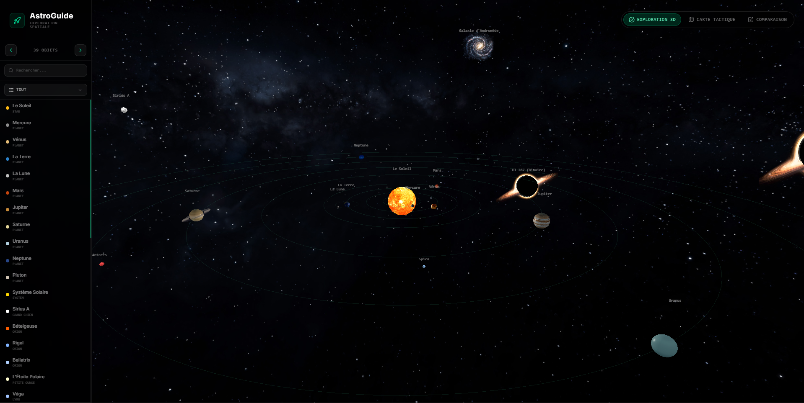

<div align="center">
  
  <h1>AstroGuide</h1>
  <p><strong>Exploration spatiale interactive en 3D, carte illustrative et comparaison de tailles.</strong></p>
  
</div>

AstroGuide est une application web statique en français. Elle permet de parcourir un catalogue de 39 objets célestes dans trois vues complémentaires, sans compte, backend ni collecte de données personnelles.

## Fonctionnalités

- exploration 3D avec textures, orbites animées et contrôle de caméra ;
- carte 2D zoomable et déplaçable, utilisable à la souris ou au tactile ;
- comparaison de diamètres ou d'étendues approximatifs ;
- recherche, filtres, constellations et sélection des objets à comparer ;
- interface adaptée au bureau, à la tablette, au mobile portrait et paysage ;
- arrêt de la boucle de rendu WebGL lorsque la vue 3D est masquée ;
- matériaux de secours lorsqu'une texture ne peut pas être chargée.

> [!IMPORTANT]
> AstroGuide est une visualisation pédagogique. Les positions, distances visuelles, orbites et tailles 3D sont illustratives. Les valeurs textuelles sont arrondies, certaines grandeurs astrophysiques restent incertaines, et une taille minimale d'affichage est appliquée dans la comparaison.

## Stack

- React 19 et TypeScript strict ;
- Vite 6 et Tailwind CSS 4 ;
- Three.js, React Three Fiber et Drei ;
- Zustand pour l'état ;
- Motion pour les transitions ;
- Vitest et ESLint pour les contrôles automatisés ;
- Nginx non privilégié dans l'image Docker.

## Prérequis

- Node.js 22.12 ou version ultérieure de la branche 22 ;
- npm 10 ou ultérieur ;
- Docker avec Docker Compose pour le déploiement conteneurisé.

## Installation locale

```bash
git clone https://github.com/lucas-lepajollec/AstroGuide.git
cd AstroGuide
npm ci --include=optional
npm run dev
```

L'application est ensuite accessible sur `http://localhost:2499` et sur les adresses réseau affichées par Vite.

## Contrôles qualité

```bash
npm run check
```

Cette commande exécute le lint réel, la vérification TypeScript, les tests puis le build de production. Les commandes peuvent aussi être lancées séparément :

| Commande | Rôle |
| --- | --- |
| `npm run lint` | ESLint sans avertissement autorisé |
| `npm run typecheck` | Vérification TypeScript sans émission |
| `npm run test` | Tests Vitest |
| `npm run build` | TypeScript puis build Vite dans `dist/` |
| `npm run dev:demo` | Mode démo local avec accueil et remise à zéro |
| `npm run build:demo` | Build statique isolé de la démonstration publique |
| `npm run preview` | Prévisualisation du build sur le réseau local |
| `npm run clean` | Suppression multiplateforme de `dist/` |

## Docker

Construction locale reproductible depuis le lockfile :

```bash
docker compose up --build -d
```

AstroGuide répond alors sur `http://localhost:2502`. Le conteneur s'exécute sans privilèges, avec un système de fichiers en lecture seule, un healthcheck et des en-têtes HTTP de sécurité.

Le workflow GitHub publie également `ghcr.io/lucas-lepajollec/astroguide` après les validations des poussées sur `main` et des tags `v*`. La disponibilité d'une architecture donnée dépend de la dernière exécution de publication réussie.

## Structure réelle

```text
AstroGuide/
├── .github/                 # modèles et workflows CI / image
├── public/                  # logo, capture et textures
├── src/
│   ├── components/         # vues 3D, 2D, comparaison et interface
│   ├── data/               # catalogue céleste et tests d'intégrité
│   ├── store/              # état Zustand et tests
│   ├── App.tsx
│   ├── index.css
│   └── main.tsx
├── Dockerfile
├── docker-compose.yml
├── nginx.conf
└── package.json
```

## Données et limites scientifiques

Les ordres de grandeur proviennent principalement des ressources de la [NASA consacrées au Système solaire](https://science.nasa.gov/solar-system/), des [résultats scientifiques de l'Event Horizon Telescope sur M87*](https://arxiv.org/abs/1906.11243), des observations NASA de [Bételgeuse](https://science.nasa.gov/universe/what-is-betelgeuse-inside-the-strange-volatile-star/) et des informations [Hubble/Gaia sur l'avenir de la Voie lactée et d'Andromède](https://science.nasa.gov/missions/hubble/apocalypse-when-hubble-casts-doubt-on-certainty-of-galactic-collision/).

Les masses de trous noirs lointains sont des estimations dépendantes des modèles. Phoenix A est explicitement présenté comme un candidat très incertain. Les contributions qui modifient le catalogue doivent citer une source scientifique ou institutionnelle et conserver les unités cohérentes.

## Confidentialité et sécurité

L'application n'utilise ni cookie, ni stockage local, ni analytique, ni API distante. Elle n'a besoin d'aucune variable d'environnement ou clé API. Consultez [SECURITY.md](SECURITY.md) pour signaler une vulnérabilité.

## Démonstration publique

Le mode démo réutilise le vrai produit et son catalogue intégré. Il n'ajoute aucun compte, backend, appel vers une infrastructure privée ou donnée fictive. Son état est temporaire et revient à sa configuration initiale lors d'une réinitialisation ou d'un rechargement.

```bash
npm run dev:demo
npm run build:demo
```

Le build démo ajoute un accueil explicatif, un marquage permanent, une commande de remise à zéro et des directives `noindex`. La configuration Vercel applique également les en-têtes de sécurité et le fallback nécessaire à l'application monopage. Voir [DEMO.md](DEMO.md) pour le périmètre et la procédure de validation.

## Contribution et licence

Les contributions sont bienvenues : voir [CONTRIBUTING.md](CONTRIBUTING.md) et [CODE_OF_CONDUCT.md](CODE_OF_CONDUCT.md). AstroGuide est distribué sous licence [MIT](LICENSE).
